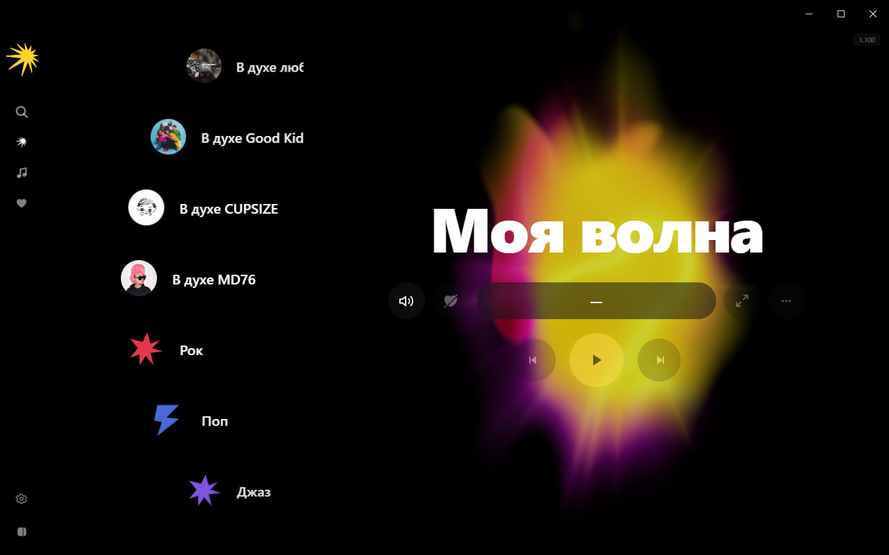
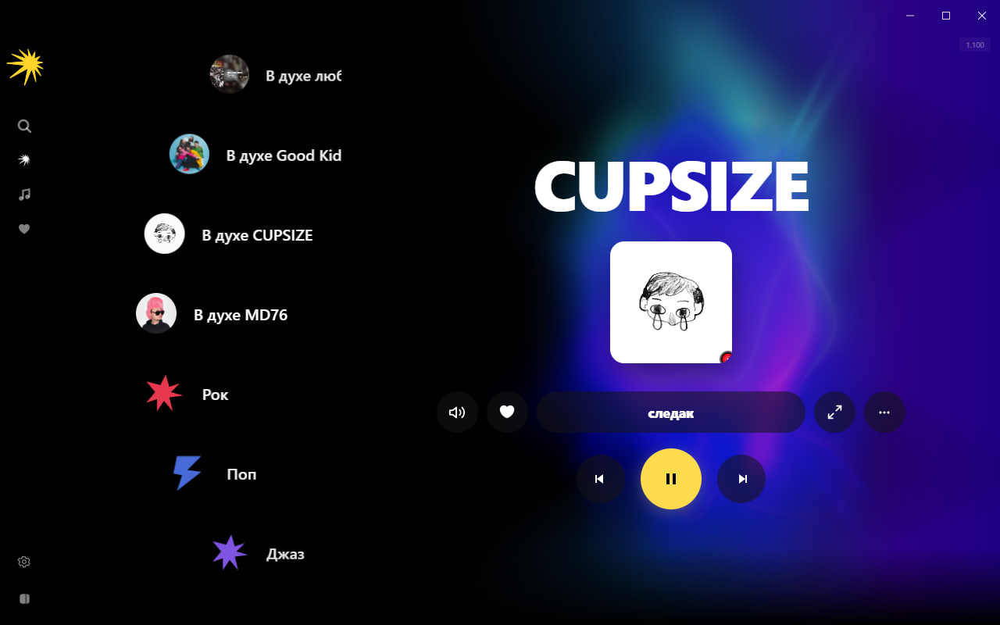
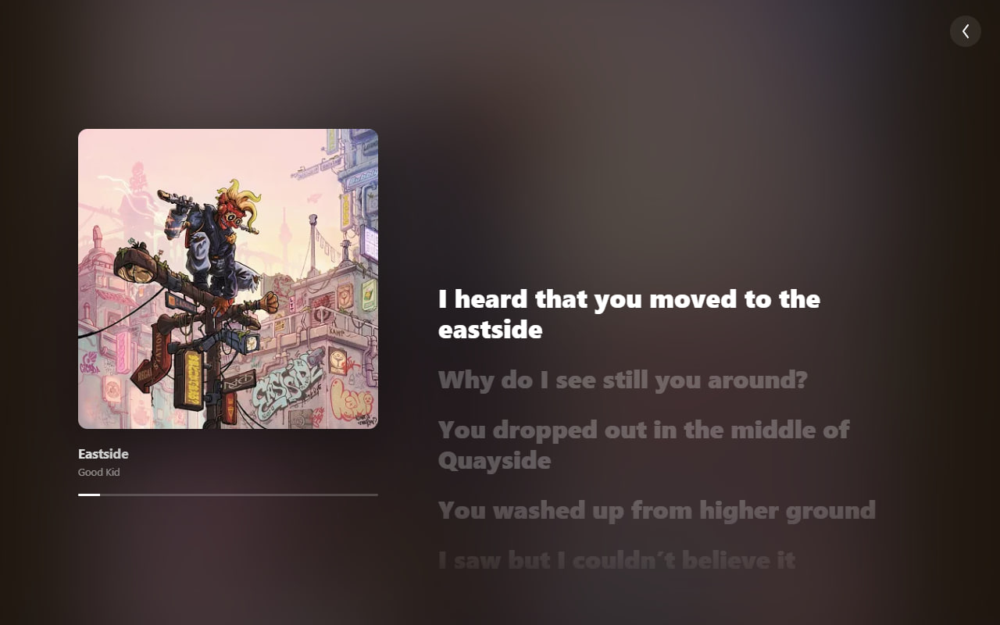

# Blueberry Desktop

An independent, open-source Electron music player. Search and play tracks from SoundCloud and YouTube, with lyrics, a reactive shader background, and an infinite "wave" queue generator — no account or authentication required.

> **Disclaimer:** Blueberry Desktop is an independent, unofficial, community-built project. It is **not affiliated with, endorsed by, sponsored by, or in any way officially connected to Yandex LLC, Yandex Music, or any of their subsidiaries or affiliates.** Any resemblance in name or UI concept to Yandex Music is coincidental/inspirational only — no Yandex trademarks, branding, logos, or proprietary assets are used, and no Yandex source code is included. "Yandex" and "Яндекс Музыка" are trademarks of their respective owners. This project only talks to Yandex's public catalog API for optional chart/search data, exactly as any third-party client is free to do, and is licensed entirely separately from and independently of Yandex's own software.

## Preview

<p align="center">
  
  
  
</p>

## Features

- **Multi-source playback** — resolves tracks across SoundCloud, YouTube, and Yandex Music's public catalog (charts/search only, no account needed).
- **Lyrics** — auto-loaded from lrclib.net, synced (LRC) and plain text, cached locally.
- **System tray** — play/pause, next/previous, window hide to tray.
- **Reactive background** — Three.js plasma shader that responds to audio frequencies.
- **Persistent storage** — likes, playlists, play history survive restarts (localStorage + file backup).
- **"My Wave"** — infinite queue generator, biased toward your own likes/history as it goes.
- **Fullscreen player** — optional YouTube video-clip background (toggle in Settings), synced lyrics view.
- **No authentication** — everything works anonymously, no account of any kind required.
- **Auto-update** — checks GitHub Releases on startup, prompts to restart once downloaded.

## Getting started

### Prerequisites

- Node.js 18+
- Python 3.10+ (for the sidecar, dev mode only)
- Windows (macOS/Linux builds not tested)

### Install

```bash
pnpm install
cd server
python -m venv .venv
.venv\Scripts\activate
pip install -r requirements.txt
cp .env.example .env
```

Edit `server/.env` and fill in `SOUNDCLOUD_CLIENT_ID` (a public SoundCloud client ID — obtain from any SoundCloud web request or community sources).

### Development

```bash
npm run dev
```

The Electron window opens, the Python sidecar starts automatically on port 8787.

### Production build

```bash
npm run dist:win
```

This will:
1. Compile the Python sidecar into `music-server.exe` via PyInstaller
2. Build the Electron app via electron-vite
3. Package into a Windows installer via electron-builder

No Python runtime is needed on the target machine — the server is a self-contained executable.

### Releasing (auto-update)

The app checks GitHub Releases for updates on startup (via `electron-updater`)
and offers a restart-to-install prompt once a new version finishes
downloading — nothing else to wire up on the user's end. To publish a new
version:

```bash
$env:GH_TOKEN = "<a GitHub token with repo access>"
npm run release:win
```

This builds and uploads the installer + `latest.yml` straight to
[GitHub Releases](https://github.com/blueberry-devs/blueberry-desktop/releases)
for this repo (see `build.publish` in `package.json`) — bump `version` in
`package.json` first, or electron-builder will just overwrite the existing
release for that version.

## Architecture

```
src/
  main/          Electron main process (window, tray, sidecar, IPC)
  preload/       Context bridge (IPC API for renderer)
  renderer/src/
    api/         HTTP client for the Python sidecar
    components/  React components (NowPlayingPanel, SearchView, etc.)
    player/      Player state (React Context + HTML5 Audio + HLS.js)
    services/    Lyrics cache, persistent store (IPC + localStorage)
    store/       Reactive stores for likes, playlists, history
    utils/       LRC parser
server/
  main.py        FastAPI sidecar (search, stream resolve, lyrics)
```

The renderer communicates with the Python sidecar over `localhost:8787`. In production, the sidecar is a PyInstaller-packed executable bundled into the app resources.

## Tech stack

| Layer | Technology |
|---|---|
| Desktop shell | Electron 32 |
| UI | React 18, TypeScript |
| Animations | Motion |
| Audio | HTML5 Audio, HLS.js, Web Audio API |
| Background | Three.js (custom GLSL shader) |
| Sidecar | Python, FastAPI, uvicorn, yt-dlp |
| Icons | Inline SVG |
| Updates | electron-updater (GitHub Releases) |

## License

Licensed under the **GNU General Public License v3.0** — see [LICENSE](LICENSE) for the full text. This covers this project's own source code only; it does not grant any rights to any third-party trademarks, logos, or branding mentioned above.
